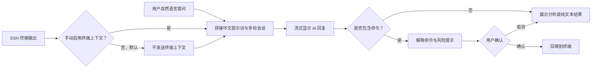

<div align="center">

# PuTTY AI

### 让 SSH 终端听懂自然语言

基于 [PuTTY](https://www.chiark.greenend.org.uk/~sgtatham/putty/) 的 AI 增强型 SSH 客户端，  
把终端上下文、故障分析、命令生成与执行确认集中在同一个窗口中。


</div>

> [!IMPORTANT]
> `v1.0.0` 已完成本轮开发、问题修复、功能优化和回归测试。Windows 客户端已集成 AI 侧边栏、可选终端上下文、兼容模型接口、命令确认与安全控制。AI 输出仍可能出错，执行任何生成命令前必须人工复核，暂不建议直接用于无人值守生产操作。

本项目由独立开发者维护，不隶属于 PuTTY、OpenAI、任何模型服务商或堡垒机产品供应商，也不代表这些项目或机构获得授权、赞助或认可。第三方名称仅用于说明兼容性和许可证归属，相关权利归各自权利人所有。

## 项目简介

开发、运维和技术支持人员经常需要在 SSH 终端、搜索引擎与 AI 工具之间反复切换：复制报错、补充上下文、生成命令，再粘贴回终端执行。这个过程不仅影响效率，还容易遗漏关键信息或误执行命令。

PuTTY AI 在保留 PuTTY 原有使用习惯的基础上，为终端增加了一个可按需感知当前会话上下文的 AI 助手。用户可以直接用自然语言描述问题，由 AI 辅助分析日志、解释命令、定位故障并生成操作建议。

## 已实现能力

- **可选终端上下文**：终端上下文默认不发送，用户可按需附带经过脱敏的当前 SSH 会话内容。
- **自然语言交互**：直接询问报错原因、系统状态、排查思路或 Linux 命令用法。
- **故障与日志分析**：结合终端输出总结异常信息，并给出可验证的排查步骤。
- **流式响应**：Chat Completions 请求开启流式响应，收到内容分片后立即更新右侧会话区。
- **中文多轮会话**：界面提示、设置信息、系统提示词和模型请求上下文均使用中文，并支持连续追问。
- **命令生成与解释**：生成候选命令，同时说明用途、参数和潜在影响。
- **确认后回填终端**：命令先展示、后确认，再发送到 SSH 终端，降低误操作风险。
- **兼容自定义模型**：支持 OpenAI Chat Completions 兼容接口，接口配置和 API Key 可跨会话持久保存。

## 交互流程



## 适用场景

| 场景 | 示例问题 |
| --- | --- |
| 故障排查 | “这个服务为什么启动失败？” |
| 日志分析 | “帮我总结这段日志里的关键异常。” |
| 系统检查 | “找出占用磁盘空间最大的目录。” |
| 命令学习 | “解释这条命令每个参数的作用。” |
| 日常运维 | “给出安全重启该服务的步骤。” |

主要面向开发工程师、运维工程师、测试人员、技术支持人员，以及正在学习 Linux 和 SSH 的用户。

## 本版本修复与优化

- 修复右侧聊天经过一至两轮后正文偶发变为白色、必须重新选中才能恢复黑色的问题；会话区重绘后继续保持可读的黑色正文。
- Chat Completions 请求已启用流式响应，首个内容分片到达后立即显示，不再等待完整回复生成完毕。
- 终端上下文默认不传递；右侧提示信息和设置项已统一为中文。
- 右侧聊天面板常规宽度已扩大到 480 像素，并会随窗口宽度响应式调整，避免文字被遮挡。
- 流式接收和完整回复都会渲染 Markdown；标题、粗体、斜体、删除线、列表、引用、表格、链接、行内代码和围栏代码块不再显示为原始语法。
- 用户问题、AI 回复、系统消息和错误消息使用不同的标签色、正文色和背景色，连续多轮对话仍能快速分辨双方内容。

## 从源码构建

仓库中的 Windows `putty` 目标会生成带原生 AI 侧边栏的 `putty.exe`。实现仅依赖 Windows 自带的 WinHTTP、Rich Edit 和数据保护 API，不需要浏览器组件。

### 环境要求

- Windows 10/11
- CMake 3.7 或更高版本
- Visual Studio 2022，并安装“使用 C++ 的桌面开发”工作负载

### 构建步骤

```powershell
cmake -S putty-src -B build -G "Visual Studio 17 2022" -A x64
cmake --build build --config Release --target putty
```

构建完成后，可执行文件通常位于：

```text
build\Release\putty.exe
```

仓库也提供了会自动定位 Visual Studio 2022 Build Tools 的构建脚本：

```powershell
scripts\build-windows.cmd
```

## 自动化启动兼容与连接保活

- 支持自动化启动器通过 `@会话名`、`-load 会话名`、`-load tmp:临时配置文件` 或 `-raw -P 本地端口` 启动连接。`tmp:` 文件按 UTF-8 的 `键=值` 格式读取，支持 HostName、PortNumber、UserName、WinTitle、终端尺寸和编码等 PuTTY 字段；未知字段会被忽略。若 Raw 会话只提供有效的本地中转端口，程序会补全 `127.0.0.1` 并直接连接，不会跳转到 Configuration。
- 非串口会话的应用层保活间隔会限制在最多 30 秒（未配置或配置过长时使用 30 秒），同时启用 Windows TCP keepalive；TCP 首次探测时间为 30 秒，后续探测间隔为 10 秒，以避免堡垒机、NAT 或防火墙因空闲而回收连接。
- 保活用于避免空闲超时。若网络实际中断或远端关闭 SSH 传输，原会话无法无损恢复，需要重新连接。

自动化启动器可以使用以下形式直接建立 SSH 会话，其中临时配置文件至少包含 `HostName`、`PortNumber` 和 `UserName`：

```powershell
putty.exe -load "tmp:C:\path\to\session.conf" -pw "password"
```

PuTTY 会加载临时配置和密码后直接连接，不显示 Configuration 页面。正式版不会记录原始启动命令行，避免 `-pw`、用户名、主机和其他敏感参数写入诊断文件。

## AI 面板使用

建立 SSH 会话后，右侧会显示 PuTTY AI 面板：

1. 点击 **设置**，通过中文设置项填写 OpenAI Chat Completions 兼容接口地址、模型名和 API Key；右侧按钮、状态和提示信息均使用中文。
2. 点击 **永久保存** 后，接口地址、模型、API Key 和上下文长度都会保存到当前用户配置，并在下次打开会话时恢复且可继续编辑。API Key 使用 Windows DPAPI 按当前用户加密，不以明文写入注册表。
3. 终端上下文默认不发送；需要时手动勾选 **附带已脱敏的终端上下文**。该选项不影响多轮聊天记录的传递。终端上下文默认最多读取 12,000 个字符，可配置范围为 1,000～64,000。
4. 模型请求使用流式响应，收到首个内容分片后会立即显示并随内容增长持续渲染 Markdown；回复完成后再使用完整内容定稿，避免残留原始 Markdown 标记。
5. 终端上下文发送前会进行尽力而为的密码、令牌、授权头和私钥脱敏。
6. 当前窗口内支持多轮会话，后续问题会携带此前成功的问题和回答；拼接的会话上下文和系统提示词使用中文，并要求模型使用简体中文回答。系统提示词不要求每次给出命令，模型可以直接返回分析或纯文本结论。
7. 回复中的 Markdown 标题、粗体、斜体、删除线、列表、引用、表格、链接、行内代码和代码块会转换为原生富文本。识别到命令后可点击 **填入命令**；程序只把命令回填到终端，不会自动发送 Enter。
8. 用户、AI、系统和错误消息具有不同的标签、文字和背景样式；多轮聊天和会话区重绘不会把正文变成白色。
9. 从右侧聊天区点击回左侧终端即可恢复键盘交互。删除、格式化、停服、改权限等高风险命令需要两次确认。

右侧面板的常规宽度为 480 像素；窗口较窄时会响应式收缩，并为左侧终端保留可交互区域。

也可以通过环境变量提供当前会话的默认值：

```powershell
$env:OPENAI_BASE_URL = "https://example.com/v1"
$env:OPENAI_MODEL = "your-model"
$env:OPENAI_API_KEY = "your-api-key"
```

`OPENAI_BASE_URL` 可以是服务根地址或完整的 `/chat/completions` 地址。环境变量只在没有已保存值时作为默认值；点击 **永久保存** 或发起请求后，当前设置会写入当前用户配置。

### 审计

- 程序默认记录不含问题、回复、上下文、命令正文和 API Key 的元数据审计日志，位置为 `%LOCALAPPDATA%\PuTTY AI\audit.log`。日志只包含时间、事件类型、模型端点主机和风险级别等信息。

## 测试与验证

本版本已完成并通过以下回归测试：

| 序号 | 回归场景 | 预期结果 |
| --- | --- | --- |
| 1 | 清理含前后不可见空白的 IPv4 地址文本 | 地址内容保持正确，不因 CR/LF 等字符导致解析失败 |
| 2 | 编辑并永久保存 Chat Completions 配置 | 关闭并重新打开会话后配置仍然存在、可编辑且可正常调用 |
| 3 | 在右侧聊天后返回左侧终端 | 左侧终端立即恢复鼠标和键盘交互 |
| 4 | 永久保存 API Key | 关闭当前会话并重新打开后 API Key 仍可正常使用 |
| 5 | 检查发送给模型的上下文和提示词 | 拼接内容使用中文，模型默认使用简体中文回答 |
| 6 | 请求问题分析而非命令 | 系统提示词允许模型返回分析或纯文本，不强制每次输出命令行 |
| 7 | 连续进行多轮问答 | 后续请求携带此前成功的问答记录并保持会话连贯 |
| 8 | 检查知识库功能及相关提示词 | 知识库功能已移除，界面和提示词中均无残留 |
| 9 | PuTTY 长时间保持远程连接 | 无客户端主动空闲断开；应用层和 TCP 保活避免出现 `Network error: Software caused connection abort` |
| 10 | 自动化启动器使用 `-load tmp:临时配置文件 -pw 密码` 启动 PuTTY | 正确读取 HostName、PortNumber、UserName 并直接建立 SSH 会话，不显示 Configuration 页面 |
| 11 | 模型流式返回 Markdown 标题，完成时包含粗体列表和代码块 | 流式阶段立即显示标题样式；完成后语法标记被移除并保留对应富文本格式 |
| 12 | 连续检查用户问题与 AI 回复 | 双方使用不同标签色、正文色和背景色，消息边界清晰且正文始终可读 |

自动化与远程验证入口：

```powershell
# 配置、公网 IPv4、连接保活、终端与行编辑回归测试
build\Release\test_conf.exe
build\Release\test_terminal.exe
build\Release\test_lineedit.exe

# 本地兼容模型 + 远程终端端到端测试
powershell -ExecutionPolicy Bypass -File tests\run-integration.ps1

# 危险命令二次确认测试
powershell -ExecutionPolicy Bypass -File tests\run-integration.ps1 -Dangerous

# 公开 SSH 服务握手测试（不使用本机凭据）
powershell -ExecutionPolicy Bypass -File tests\run-remote-ssh.ps1

# 指定自有或获准测试的 SSH 服务
powershell -ExecutionPolicy Bypass -File tests\run-remote-ssh.ps1 `
  -HostName ssh.example.com -Port 22
```

远程验证默认连接 `ssh.github.com:443`，禁用 Pageant 和连接共享，只验证主机密钥协商及服务端进入 `publickey` 认证阶段。未提供凭据时出现 `No supported authentication methods available (server sent: publickey)` 是预期结果，表示 SSH 连接和握手已经成功到达认证阶段。

打包产物位于 `package/PuTTY-AI-v1.0.0-windows-x64.zip`，包含 `putty.exe`、应用本地 VC Runtime、项目与 PuTTY 许可证、第三方说明和发布说明。

## 已完成的开发内容

- [x] 导入 PuTTY 0.84 源码
- [x] 明确产品定位与核心交互流程
- [x] 实现终端右侧 AI 交互面板
- [x] 实现会话上下文提取与长度控制
- [x] 接入 OpenAI Chat Completions 兼容接口
- [x] 支持 Chat Completions 流式响应
- [x] 默认不发送终端上下文，并支持按需附带脱敏内容
- [x] 支持中文提示词与多轮会话
- [x] 完成右侧提示信息和设置项中文化
- [x] 支持 Chat Completions 配置和 API Key 跨会话持久化
- [x] 支持流式和完成态 Markdown 富文本渲染、代码块与命令展示
- [x] 使用独立视觉样式区分用户问题、AI 回复、系统消息和错误消息
- [x] 支持命令确认和一键回填
- [x] 修复会话区文字颜色和左右区域焦点切换问题
- [x] 扩大右侧聊天面板并支持响应式宽度
- [x] 支持 IPv4 地址清理、通用临时配置启动和长连接保活
- [x] 移除知识库功能及提示词残留
- [x] 增加危险命令识别与二次确认
- [x] 增加敏感信息脱敏与隐私控制
- [x] 增加元数据操作审计等扩展能力

## 项目结构

```text
putty-ai/
├── putty-src/              # PuTTY 0.84 与 PuTTY AI 源代码
│   └── windows/ai.c        # AI 面板、模型调用、安全与审计实现
├── package/                # 构建后生成的 Windows 发布包
└── readme.md               # 项目说明
```

## 安全与隐私

AI 生成的命令可能不准确，也可能不适合当前环境。执行任何命令前，请确认目标主机、权限范围和命令影响，尤其要谨慎处理删除文件、修改权限、停止服务等高风险操作。

当前版本已经提供上下文范围控制、敏感信息脱敏、API Key 的 Windows DPAPI 用户级保护和危险命令确认机制。正式版不记录原始启动命令行。即使如此，也不应向不受信任的模型服务发送密码、私钥、令牌或其他机密信息。

## 参与贡献

欢迎通过 Issue 提交使用场景、功能建议和问题反馈，也欢迎参与 AI 面板、模型接入、安全策略与文档等方向的开发。

提交代码前，请尽量确保改动范围清晰，并附上必要的构建或测试说明。

## 致谢与许可证

本项目基于 [PuTTY](https://www.chiark.greenend.org.uk/~sgtatham/putty/) 0.84 源码进行探索和开发，并非 PuTTY 官方项目。

PuTTY AI 的原创增量代码和项目材料适用仓库根目录的 [LICENSE](LICENSE)。仓库中的 PuTTY 源代码仍遵循其原始许可条款，详情请查看 [putty-src/LICENCE](putty-src/LICENCE)。保留原始版权与机构名称仅为履行许可证归属要求，不表示本项目与其存在隶属或官方关联。

---

<div align="center">

如果这个方向对你有帮助，欢迎 Star 项目并参与讨论。

</div>
