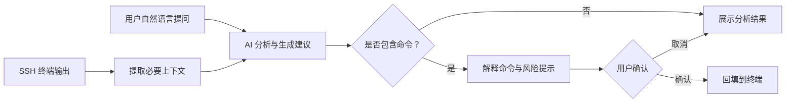

<div align="center">

# PuTTY AI

### 让 SSH 终端听懂自然语言

基于 [PuTTY](https://www.chiark.greenend.org.uk/~sgtatham/putty/) 的 AI 增强型 SSH 客户端，  
把终端上下文、故障分析、命令生成与执行确认集中在同一个窗口中。


</div>

> [!IMPORTANT]
> 项目目前处于早期开发阶段。仓库已包含 PuTTY 0.84 源码与产品方案，AI 侧边栏、模型 API 接入和命令回填等能力仍在开发中，暂不建议用于生产环境。

## 项目简介

开发、运维和技术支持人员经常需要在 SSH 终端、搜索引擎与 AI 工具之间反复切换：复制报错、补充上下文、生成命令，再粘贴回终端执行。这个过程不仅影响效率，还容易遗漏关键信息或误执行命令。

PuTTY AI 希望在保留 PuTTY 原有使用习惯的基础上，为终端增加一个可感知当前会话上下文的 AI 助手。用户可以直接用自然语言描述问题，由 AI 辅助分析日志、解释命令、定位故障并生成操作建议。

## 目标能力

- **终端上下文感知**：按需读取当前 SSH 会话内容，减少手动复制和补充背景信息。
- **自然语言交互**：直接询问报错原因、系统状态、排查思路或 Linux 命令用法。
- **故障与日志分析**：结合终端输出总结异常信息，并给出可验证的排查步骤。
- **命令生成与解释**：生成候选命令，同时说明用途、参数和潜在影响。
- **确认后回填终端**：命令先展示、后确认，再发送到 SSH 终端，降低误操作风险。
- **兼容自定义模型**：计划支持 OpenAI Chat Completions 兼容接口，方便接入不同模型服务。

## 目标交互流程



## 适用场景

| 场景 | 示例问题 |
| --- | --- |
| 故障排查 | “这个服务为什么启动失败？” |
| 日志分析 | “帮我总结这段日志里的关键异常。” |
| 系统检查 | “找出占用磁盘空间最大的目录。” |
| 命令学习 | “解释这条命令每个参数的作用。” |
| 日常运维 | “给出安全重启该服务的步骤。” |

主要面向开发工程师、运维工程师、测试人员、技术支持人员，以及正在学习 Linux 和 SSH 的用户。

## 从源码构建

当前可构建的是仓库中的 PuTTY 基础客户端。AI 功能完成后，相关配置与使用方法会在此处同步更新。

### 环境要求

- Windows 10/11
- CMake 3.7 或更高版本
- Visual Studio 2022，并安装“使用 C++ 的桌面开发”工作负载

### 构建步骤

```powershell
cmake -S putty-src -B build -G "Visual Studio 17 2022" -A x64
cmake --build build --config Release --target putty
```

构建完成后，可执行文件通常位于：

```text
build\windows\Release\putty.exe
```

## 开发计划

- [x] 导入 PuTTY 0.84 源码
- [x] 明确产品定位与核心交互流程
- [ ] 实现终端右侧 AI 交互面板
- [ ] 实现会话上下文提取与长度控制
- [ ] 接入 OpenAI Chat Completions 兼容接口
- [ ] 支持 Markdown、代码块与命令展示
- [ ] 支持命令确认和一键回填
- [ ] 增加危险命令识别与二次确认
- [ ] 增加敏感信息脱敏与隐私控制
- [ ] 增加企业知识库、操作审计等扩展能力

## 项目结构

```text
putty-ai/
├── putty-src/   # PuTTY 0.84 源代码
└── readme.md    # 项目说明
```

## 安全与隐私

AI 生成的命令可能不准确，也可能不适合当前环境。执行任何命令前，请确认目标主机、权限范围和命令影响，尤其要谨慎处理删除文件、修改权限、停止服务等高风险操作。

在模型接入功能完成后，项目将优先提供上下文范围控制、敏感信息脱敏和危险命令确认机制。即使如此，也不应向不受信任的模型服务发送密码、私钥、令牌或其他机密信息。

## 参与贡献

欢迎通过 Issue 提交使用场景、功能建议和问题反馈，也欢迎参与 AI 面板、模型接入、安全策略与文档等方向的开发。

提交代码前，请尽量确保改动范围清晰，并附上必要的构建或测试说明。

## 致谢与许可证

本项目基于 [PuTTY](https://www.chiark.greenend.org.uk/~sgtatham/putty/) 0.84 源码进行探索和开发，并非 PuTTY 官方项目。

仓库中的 PuTTY 源代码遵循其原始许可条款，详情请查看 [putty-src/LICENCE](putty-src/LICENCE)。

---

<div align="center">

如果这个方向对你有帮助，欢迎 Star 项目并参与讨论。

</div>
