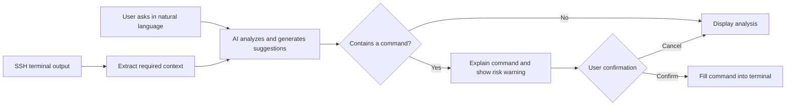

<div align="center">

# PuTTY AI

### Make your SSH terminal understand natural language

An AI-enhanced SSH client based on [PuTTY](https://www.chiark.greenend.org.uk/~sgtatham/putty/). It brings terminal context, troubleshooting analysis, command generation, and execution confirmation together in one window.


</div>

> [!IMPORTANT]
> `v1.0.0` has completed the current development, optimization, and regression-test cycle. The Windows client integrates an AI sidebar, optional terminal context, compatible model endpoints, command confirmation, and safety controls. AI output may still be incorrect. Always review generated commands manually before executing them; direct use in unattended production operations is not recommended.

This is an independently maintained project. It is not affiliated with, authorized by, sponsored by, or endorsed by PuTTY, OpenAI, any model provider, or any bastion-client vendor. Third-party names are used only to describe compatibility and license attribution; all related rights belong to their respective owners.

## Overview

Developers, operations engineers, and technical support staff often switch repeatedly between an SSH terminal, search engines, and AI tools: copy an error, add context, generate a command, then paste it back into the terminal. This workflow affects efficiency and makes it easy to miss important information or execute the wrong command.

PuTTY AI adds an AI assistant that can understand the current terminal session while preserving the familiar PuTTY workflow. Users can describe a problem in natural language and ask the AI to analyze logs, explain commands, locate faults, and generate operational suggestions.

## Features

- **Terminal context awareness**: Read the current SSH session on demand, reducing manual copying and background setup.
- **Natural-language interaction**: Ask directly about error causes, system status, troubleshooting approaches, or Linux command usage.
- **Fault and log analysis**: Summarize anomalies from terminal output and provide troubleshooting steps that can be verified.
- **Command generation and explanation**: Generate candidate commands and explain their purpose, parameters, and potential impact.
- **Fill after confirmation**: Show a command first, ask for confirmation, and then send it to the SSH terminal to reduce accidental operations.
- **Compatible custom models**: Supports OpenAI Chat Completions-compatible endpoints, streaming responses, and persistent settings.

## Target Interaction Flow



## Use Cases

| Scenario | Example question |
| --- | --- |
| Troubleshooting | "Why did this service fail to start?" |
| Log analysis | "Summarize the key anomalies in this log." |
| System checks | "Find the directories using the most disk space." |
| Command learning | "Explain what each parameter in this command does." |
| Daily operations | "Give me the steps to restart this service safely." |

The project is primarily intended for development engineers, operations engineers, testers, technical support staff, and people learning Linux and SSH.

## Building from Source

The Windows `putty` target in this repository produces `putty.exe` with a native AI sidebar. The implementation uses Windows-provided WinHTTP, Rich Edit, and data-protection APIs and does not require browser components.

### Requirements

- Windows 10/11
- CMake 3.7 or later
- Visual Studio 2022 with the "Desktop development with C++" workload installed

### Build

```powershell
cmake -S putty-src -B build -G "Visual Studio 17 2022" -A x64
cmake --build build --config Release --target putty
```

After the build completes, the executable is usually located at:

```text
build\Release\putty.exe
```

The repository also provides a build script that automatically locates Visual Studio 2022 Build Tools:

```powershell
scripts\build-windows.cmd
```

## Automated Launch Compatibility and Connection Keepalive

- Automated launchers can start connections through `@session-name`, `-load session-name`, `-load tmp:temporary-config-file`, or `-raw -P local-port`. A `tmp:` file is read as UTF-8 `key=value` data and supports PuTTY fields such as HostName, PortNumber, UserName, WinTitle, terminal dimensions, and encoding; unknown fields are ignored. If a Raw session contains a valid local relay port but no host, PuTTY AI fills in `127.0.0.1` and connects directly instead of opening Configuration.
- Network sessions cap the application keepalive interval at 30 seconds (using 30 seconds when unset or configured longer) and enable Windows TCP keepalive. The first TCP probe is sent after 30 seconds and later probes use a 10-second interval, preventing idle cleanup by bastions, NAT gateways, and firewalls.
- Keepalives prevent idle timeouts. A real network outage or a remote SSH transport shutdown cannot resume the existing session and still requires reconnection.

Production builds do not record the original launch command line, preventing `-pw`, usernames, hosts, and other sensitive arguments from being written to a diagnostic file.

## Using the AI Panel

After establishing an SSH session, the PuTTY AI panel appears on the right:

1. Click **设置** and enter an OpenAI Chat Completions-compatible endpoint, model name, and API key.
2. After clicking **永久保存**, the endpoint, model, API key, and context length are persisted for the current Windows user and restored as editable values in the next session. The API key is protected with Windows DPAPI and is not stored as plaintext in the registry.
3. Terminal context is disabled by default. Select **附带已脱敏的终端上下文** only when it is needed. The default maximum is 12,000 characters; the configurable range is 1,000 to 64,000.
4. Model requests use streaming responses, so the first content chunk appears immediately. Markdown is formatted once the response completes.
5. Before terminal context is sent, the client makes a best-effort attempt to redact passwords, tokens, authorization headers, and private keys.
6. The current window supports multi-turn conversations. Later questions include previous successful questions and answers. The system asks the model to reply in Simplified Chinese by default, but permits analysis and plain-text conclusions without requiring a command in every answer.
7. Markdown headings, lists, and code blocks in replies are rendered in the conversation area. When a command is detected, click **填入命令**; the program only fills the command into the terminal and does not press Enter automatically.
8. Clicking the terminal after using the right-side chat restores keyboard interaction. High-risk commands such as deleting files, formatting disks, stopping services, or changing permissions require two confirmations.

The panel uses a 480-pixel normal width and shrinks responsively in narrow windows while retaining an interactive terminal area.

You can also provide session defaults through environment variables:

```powershell
$env:OPENAI_BASE_URL = "https://example.com/v1"
$env:OPENAI_MODEL = "your-model"
$env:OPENAI_API_KEY = "your-api-key"
```

`OPENAI_BASE_URL` can be a service root URL or a complete `/chat/completions` URL. Environment variables are defaults only when no saved value exists; clicking **永久保存** or sending a request persists the current settings.

### Auditing

- By default, the program records metadata-only audit logs that exclude questions, replies, context, command bodies, and API keys. The log is stored at `%LOCALAPPDATA%\PuTTY AI\audit.log` and contains only information such as timestamps, event types, the model endpoint host, and risk levels.

## Testing and Verification

```powershell
# Configuration, IPv4 cleanup, keepalive, terminal, and line-edit tests
build\Release\test_conf.exe
build\Release\test_terminal.exe
build\Release\test_lineedit.exe

# Local compatible model plus remote terminal end-to-end test
powershell -ExecutionPolicy Bypass -File tests\run-integration.ps1

# Dangerous-command double-confirmation test
powershell -ExecutionPolicy Bypass -File tests\run-integration.ps1 -Dangerous

# Public SSH service handshake test (does not use local credentials)
powershell -ExecutionPolicy Bypass -File tests\run-remote-ssh.ps1

# Test an SSH service you own or are authorized to probe
powershell -ExecutionPolicy Bypass -File tests\run-remote-ssh.ps1 `
  -HostName ssh.example.com -Port 22
```

Remote verification connects to `ssh.github.com:443` by default, disables Pageant and connection sharing, and verifies only host-key negotiation and the server entering the `publickey` authentication stage. Without credentials, `No supported authentication methods available (server sent: publickey)` is an expected result: it means the SSH connection and handshake successfully reached authentication.

The packaged artifact is `package/PuTTY-AI-v1.0.0-windows-x64.zip`. It contains `putty.exe`, the application-local VC Runtime, project and PuTTY licenses, third-party notices, and release notes.

## Development Plan

- [x] Import PuTTY 0.84 source code
- [x] Define product positioning and the core interaction flow
- [x] Implement the terminal-side AI interaction panel
- [x] Implement session-context extraction and length controls
- [x] Integrate an OpenAI Chat Completions-compatible endpoint
- [x] Enable streaming responses and native Markdown formatting
- [x] Disable terminal-context transmission by default
- [x] Support Chinese prompts and multi-turn conversations
- [x] Persist Chat Completions settings and DPAPI-protected API keys across sessions
- [x] Support Markdown, code blocks, and command display
- [x] Support command confirmation and one-click filling
- [x] Add dangerous-command detection and double confirmation
- [x] Add sensitive-information redaction and privacy controls
- [x] Add metadata-only operation auditing

## Project Structure

```text
putty-ai/
├── putty-src/              # PuTTY 0.84 and PuTTY AI source code
│   └── windows/ai.c        # AI panel, model calls, safety, and auditing
├── package/                # Windows release package generated after building
└── readme.md               # Project documentation
```

## Security and Privacy

AI-generated commands may be inaccurate or unsuitable for the current environment. Before executing any command, verify the target host, permission scope, and expected impact. Take particular care with high-risk operations such as deleting files, changing permissions, or stopping services.

The current release provides context-scope controls, sensitive-information redaction, Windows DPAPI user-level protection for saved API keys, and dangerous-command confirmation. Production builds do not record original launch command lines. Even with these safeguards, do not send passwords, private keys, tokens, or other confidential information to an untrusted model service.

## Contributing

Please use Issues to submit use cases, feature suggestions, and bug reports. Contributions are also welcome in areas such as the AI panel, model integration, safety policies, and documentation.

Before submitting code, keep the scope of your changes clear and include the necessary build or test information.

## Acknowledgments and License

This project explores and develops against the [PuTTY](https://www.chiark.greenend.org.uk/~sgtatham/putty/) 0.84 source code. It is not an official PuTTY project.

Original PuTTY AI additions and project-specific materials are covered by the root [LICENSE](LICENSE). The incorporated PuTTY source remains under its original license; see [putty-src/LICENCE](putty-src/LICENCE). Original copyright holders and organization names are retained only where required for license attribution and do not imply affiliation.

---

<div align="center">

If this project is useful to you, please star the repository and join the discussion.

</div>
