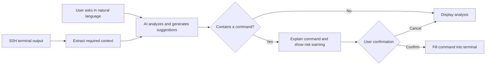

<div align="center">

# PuTTY AI

### Make your SSH terminal understand natural language

An AI-enhanced SSH client based on [PuTTY](https://www.chiark.greenend.org.uk/~sgtatham/putty/). It brings terminal context, troubleshooting analysis, command generation, and execution confirmation together in one window.


</div>

> [!IMPORTANT]
> This project is currently in preview. The Windows client integrates an AI sidebar, terminal context, compatible model endpoints, command confirmation, and safety controls. AI output may still be incorrect. Always review generated commands manually before executing them; direct use in unattended production operations is not recommended.

## Overview

Developers, operations engineers, and technical support staff often switch repeatedly between an SSH terminal, search engines, and AI tools: copy an error, add context, generate a command, then paste it back into the terminal. This workflow affects efficiency and makes it easy to miss important information or execute the wrong command.

PuTTY AI adds an AI assistant that can understand the current terminal session while preserving the familiar PuTTY workflow. Users can describe a problem in natural language and ask the AI to analyze logs, explain commands, locate faults, and generate operational suggestions.

## Target Capabilities

- **Terminal context awareness**: Read the current SSH session on demand, reducing manual copying and background setup.
- **Natural-language interaction**: Ask directly about error causes, system status, troubleshooting approaches, or Linux command usage.
- **Fault and log analysis**: Summarize anomalies from terminal output and provide troubleshooting steps that can be verified.
- **Command generation and explanation**: Generate candidate commands and explain their purpose, parameters, and potential impact.
- **Fill after confirmation**: Show a command first, ask for confirmation, and then send it to the SSH terminal to reduce accidental operations.
- **Compatible custom models**: Planned support for OpenAI Chat Completions-compatible endpoints makes it easier to connect different model services.

## Target Interaction Flow



## Use Cases

| Scenario | Example question |
| --- | --- |
| Troubleshooting | "Why did this service fail to start?" |
| Log analysis | "Summarize the key anomalies in this log." |
| System checks | "Find the directories using the most disk space." |
| Command learning | "Explain what each parameter in this command does." |
| Daily operations | "Give me the steps to restart this service safely." |

The project is primarily intended for development engineers, operations engineers, testers, technical support staff, and people learning Linux and SSH.

## Building from Source

The Windows `putty` target in this repository produces `putty-ai.exe` with a native AI sidebar. The implementation uses only Windows-provided WinHTTP and Rich Edit and does not require additional runtimes or browser components.

### Requirements

- Windows 10/11
- CMake 3.7 or later
- Visual Studio 2022 with the "Desktop development with C++" workload installed

### Build

```powershell
cmake -S putty-src -B build -G "Visual Studio 17 2022" -A x64
cmake --build build --config Release --target putty
```

After the build completes, the executable is usually located at:

```text
build\Release\putty-ai.exe
```

The repository also provides a build script that automatically locates Visual Studio 2022 Build Tools:

```powershell
scripts\build-windows.cmd
```

## Using the AI Panel

After establishing an SSH session, the PuTTY AI panel appears on the right:

1. Click **Settings** and enter an OpenAI Chat Completions-compatible endpoint, model name, and API key.
2. The API key is kept only in the current process and is never written to the registry. The endpoint, model, context length, and knowledge-file path are saved in the current user's configuration.
3. Enter a question and choose whether to attach recent terminal context. The default maximum is 12,000 characters; the configurable range is 1,000 to 64,000.
4. Before context and optional knowledge files are sent, the client makes a best-effort attempt to redact passwords, tokens, authorization headers, and private keys.
5. Markdown headings, lists, and code blocks in replies are rendered in the conversation area. When a command is detected, click **Fill command**; the program only fills the command into the terminal and does not press Enter automatically.
6. High-risk commands such as deleting files, formatting disks, stopping services, or changing permissions require two confirmations.

You can also provide session defaults through environment variables:

```powershell
$env:OPENAI_BASE_URL = "https://example.com/v1"
$env:OPENAI_MODEL = "your-model"
$env:OPENAI_API_KEY = "your-session-only-key"
```

`OPENAI_BASE_URL` can be a service root URL or a complete `/chat/completions` URL. An API key supplied through environment variables is also not persisted.

### Local Knowledge and Auditing

- Settings can select one UTF-8 or UTF-16 `.md` or `.txt` file no larger than 256 KiB as local knowledge. Its contents go through the same sensitive-field redaction before being sent.
- By default, the program records metadata-only audit logs that exclude questions, replies, context, command bodies, and API keys. The log is stored at `%LOCALAPPDATA%\PuTTY AI\audit.log` and contains only information such as timestamps, event types, the model endpoint host, and risk levels.

## Testing and Verification

```powershell
# PuTTY terminal and line-edit regression tests
build\Release\test_terminal.exe
build\Release\test_lineedit.exe

# Local compatible model plus remote terminal end-to-end test
powershell -ExecutionPolicy Bypass -File tests\run-integration.ps1

# Dangerous-command double-confirmation test
powershell -ExecutionPolicy Bypass -File tests\run-integration.ps1 -Dangerous

# Public SSH service handshake test (does not use local credentials)
powershell -ExecutionPolicy Bypass -File tests\run-remote-ssh.ps1
```

Remote verification connects to `ssh.github.com:443` by default, disables Pageant and connection sharing, and verifies only host-key negotiation and the server entering the `publickey` authentication stage. Without credentials, `No supported authentication methods available (server sent: publickey)` is an expected result: it means the SSH connection and handshake successfully reached authentication.

The packaged artifact is `package/PuTTY-AI-windows-x64.zip`. It contains `putty-ai.exe`, the application-local VC Runtime, licenses, and test reports.

## Development Plan

- [x] Import PuTTY 0.84 source code
- [x] Define product positioning and the core interaction flow
- [x] Implement the terminal-side AI interaction panel
- [x] Implement session-context extraction and length controls
- [x] Integrate an OpenAI Chat Completions-compatible endpoint
- [x] Support Markdown, code blocks, and command display
- [x] Support command confirmation and one-click filling
- [x] Add dangerous-command detection and double confirmation
- [x] Add sensitive-information redaction and privacy controls
- [x] Add local knowledge files and metadata-only operation auditing

## Project Structure

```text
putty-ai/
├── putty-src/              # PuTTY 0.84 and PuTTY AI source code
│   └── windows/ai.c        # AI panel, model calls, safety, and auditing
├── package/                # Windows release package generated after building
└── readme.md               # Project documentation
```

## Security and Privacy

AI-generated commands may be inaccurate or unsuitable for the current environment. Before executing any command, verify the target host, permission scope, and expected impact. Take particular care with high-risk operations such as deleting files, changing permissions, or stopping services.

After model integration is complete, the project will prioritize context-scope controls, sensitive-information redaction, and dangerous-command confirmation. Even with these safeguards, do not send passwords, private keys, tokens, or other confidential information to an untrusted model service.

## Contributing

Please use Issues to submit use cases, feature suggestions, and bug reports. Contributions are also welcome in areas such as the AI panel, model integration, safety policies, and documentation.

Before submitting code, keep the scope of your changes clear and include the necessary build or test information.

## Acknowledgments and License

This project explores and develops against the [PuTTY](https://www.chiark.greenend.org.uk/~sgtatham/putty/) 0.84 source code. It is not an official PuTTY project.

The PuTTY source code in this repository is distributed under its original license. See [putty-src/LICENCE](putty-src/LICENCE) for details.

---

<div align="center">

If this project is useful to you, please star the repository and join the discussion.

</div>
